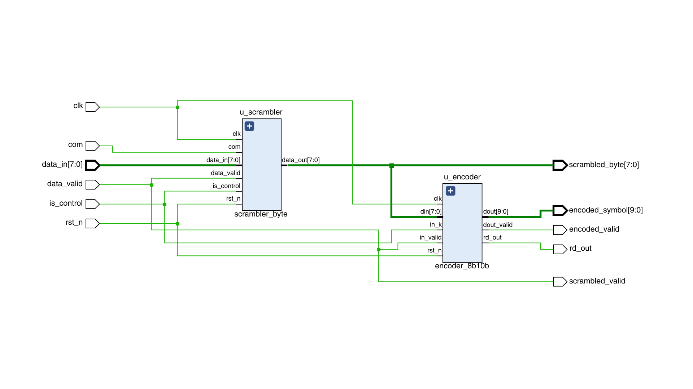
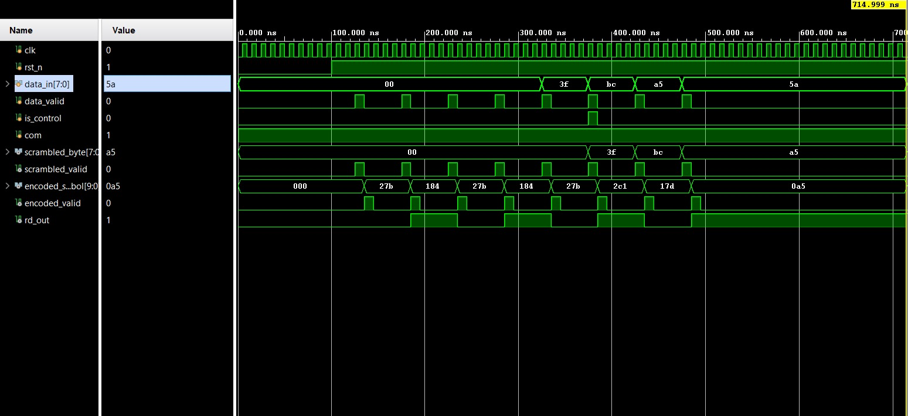

<p align="center">
  <h1 align="center">⚡ USB 3.0 PHY Transmitter Modules</h1>
  <p align="center">
    <strong>Verilog RTL implementation of USB 3.0 Physical Layer transmitter on Xilinx Zynq-7000 (ZedBoard)</strong>
  </p>
  <p align="center">
    
    
    
    
  </p>
</p>

---

##  Overview

This project implements key **USB 3.0 Physical Layer (PHY) transmitter** modules in synthesizable Verilog, targeting the **Xilinx Zynq-7000 SoC** on the Avnet ZedBoard. The design covers the data-path from raw bytes to line-coded symbols ready for differential transmission.

**Implemented modules:**

| Module | Description |
|--------|-------------|
| **LFSR Scrambler** | 16-bit LFSR (`X¹⁶ + X⁵ + X⁴ + X³ + 1`) randomizes data to reduce EMI |
| **8b/10b Encoder** | Maps 8-bit data → 10-bit DC-balanced symbols for clock recovery |
| **PHY TX Top** | Top-level wrapper integrating scrambler and encoder pipeline |

The project includes full RTL source, a self-checking testbench, simulation waveforms, and Vivado synthesis/implementation reports with area and power analysis.

---

## ️ USB 3.0 Physical Layer Architecture

USB 3.0 (SuperSpeed) uses a layered communication model. The **Physical Layer** sits at the bottom and is responsible for preparing data for transmission over differential pairs at 5 Gbps.

```
┌──────────────────────────────┐
│       Protocol Layer         │  ← Transaction management
├──────────────────────────────┤
│         Link Layer           │  ← Flow control, error handling
├──────────────────────────────┤
│       Physical Layer         │  ← This project
│  ┌────────┐  ┌────────────┐  │
│  │Scrambler│─▶│8b/10b Enc. │──▶ Differential Driver
│  └────────┘  └────────────┘  │
└──────────────────────────────┘
```

---

## LFSR Scrambler

The scrambler employs a **16-bit Linear Feedback Shift Register** with the USB 3.0 specified polynomial:

```
G(X) = X¹⁶ + X⁵ + X⁴ + X³ + 1
```

**Key characteristics:**

- **Seed:** `0xFFFF` (all ones initialization)
- **Operation:** XOR between input data bits and LFSR output sequence
- **Skip support:** LFSR hold on non-data symbols (e.g., SKP ordered sets)
- **Scope:** Applied to data symbols only — control symbols pass through unscrambled

> Scrambling breaks up long runs of identical bits, reducing electromagnetic interference (EMI) and improving signal integrity on the physical link.

---

## 8b/10b Encoder

The encoder converts each **8-bit data word** into a **10-bit transmission symbol** using the standard 8b/10b line-coding scheme:

```
  8-bit Input
  ┌───┬───┐
  │5b │3b │   Split
  └─┬─┴─┬─┘
    │    │
  ┌─▼─┐┌─▼─┐
  │5b/ ││3b/ │   Encode
  │6b  ││4b  │
  └─┬─┘└─┬──┘
    │    │
  ┌─▼────▼─┐
  │ 10-bit  │   Combine
  │ Symbol  │
  └─────────┘
```

**Benefits:**

- **DC Balance** — equal number of 1s and 0s over time via running disparity tracking
- **Clock Recovery** — guaranteed transitions enable CDR circuits to lock
- **Boundary Detection** — special comma characters (K-codes) mark word boundaries
- **Error Detection** — invalid 10-bit codes indicate transmission errors

---

## 📐 Design Schematics

<p align="center">
  <strong>Top-Level Module</strong><br>
  
</p>

<p align="center">
  <strong>Scrambler Module</strong><br>
  
</p>

<p align="center">
  <strong>8b/10b Encoder Module</strong><br>
  
</p>

---

## Simulation Waveform

Verification waveform captured from the testbench showing scrambler and encoder operation:

<p align="center">
  
</p>

---

## FPGA Implementation Results

Synthesized and implemented on **Xilinx Zynq-7000 (xc7z020clg484-1)** using **Vivado 2024**.

### Power Analysis

| Module | Estimated Power |
|--------|----------------|
| Scrambler | **3.401 W** |
| Encoder | **0.597 W** |

<p align="center">
  
</p>

### Area / Resource Utilization

<p align="center">
  
</p>

> Resource usage includes LUT, Flip-Flop, and I/O utilization metrics, confirming efficient hardware realization of the PHY transmitter pipeline.

---

